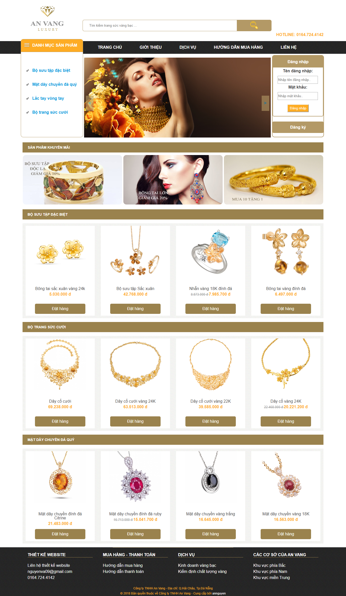
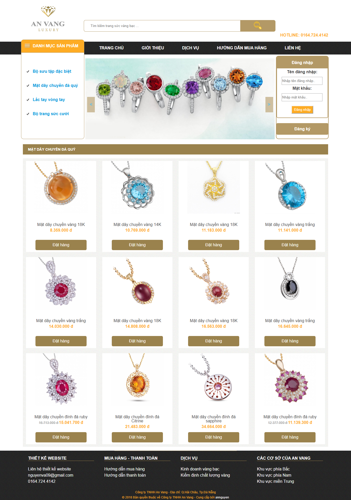
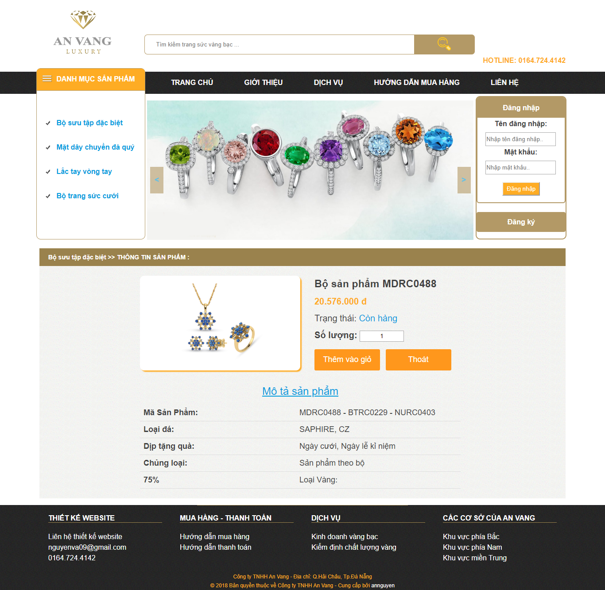
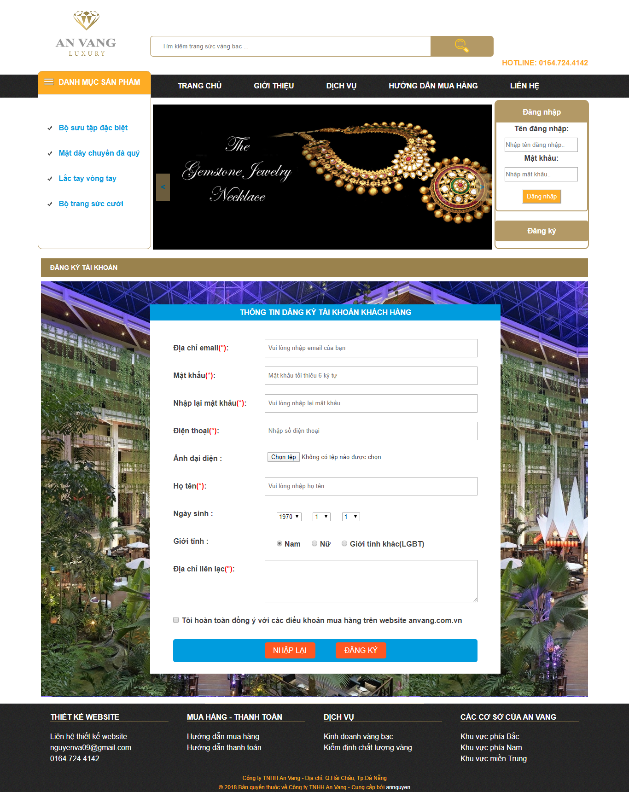
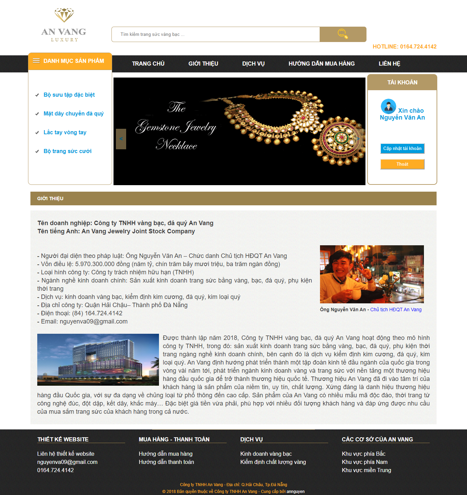

# 
AnVangLuxury

	(My first backend website project)

# Giới thiệu
Website "An Vang Luxury" xâu dựng với mục đích phục vụ hoạt động mua bán, kinh doanh vàng bạc trực tuyến. Website có thể áp dụng cho các cửa hàng, công ty kinh doanh vàng vừa và nhỏ.

# Công nghệ sử dụng
- Backend: PHP
- Frontend: html5, css3, javascript

# Công cụ xây dựng chương trình
- IDE: Sublime Text
- Database: MySQL

# Sơ đồ quan hệ giữa các bảng trong MySQL

# Chức năng của các tác nhân
## 1. Khách hàng ##
- Đăng ký thành viên 
- Đăng nhập 
- Cập nhật thông tin tài khoản 
- Xem thông tin sản phẩm 
..................

# Một số giao diện
## a. Giao diện người dùng ##

#### 1. Trang chủ

	

#### 2. Trang sản phẩm cùng loại

	<kbd>
		
	</kbd>

#### 3. Chi tiết sản phẩm

	<kbd>
		
	</kbd>

#### 4. Đăng ký tài khoản

	<kbd>
		
	</kbd>

#### 5. Giới thiệu cửa hàng

	<kbd>
		
	</kbd>

## b. Giao diện quản trị ##

............................